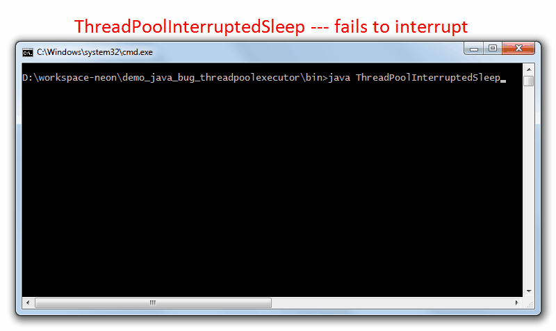

# Demo Java Bug ThredPoolExecutor Demo

This is the demo code for the Stackoverflow question 
[Interrupting Thread with ThreadPoolExecutor and ArrayBlockingQueue not working](http://stackoverflow.com/questions/42475085/interrupting-thread-with-threadpoolexecutor-and-arrayblockingqueue-not-working). 

## The Problem

The demo code implements a shutdown hook. If you one of this applications from command line (not from eclipse) 
and press <kbd>CRTL</kbd>-<kbd>C</kbd>. The shutdown hook will interrupt the main running thread and wait up to 
10 Seconds for the main thread to finish. Depending on the time where you press <kbd>CRTL</kbd>-<kbd>C</kbd> the 
thread will be interrupted in the ThreadPool `.submit()` or the ThreadPool `.awaitTermination()` part. 

Normally the Thread will be interrupted and the ThreadPool `.shutdownNow()` will tear down the rest of the threads 
queued. No Problem so far.

If I start a runner thread with a `Thread.sleep()` with a `ThreadPoolExecutor` using a `ArrayBlockingQueue` or 
`LinkedBlockingDeque` the code will not interrupt as expected. Only one of the running sub thread is interrupted, 
but no the main thread. The program is running until the shutdown hook will exit after 10 seconds.

To run the application in Eclipse I created a `ThreadInterupter` which is interrupting the main thread after 15 seconds.

## Demo Code

The Demo Code consists of 4 independent java files, each has all the code it needs and can totally run on it's own.

#### Code with Problem

- [ThreadPoolInterruptedSleep](src/ThreadPoolInterruptedSleep.java)

#### Code with no Problem

- [FixedPoolInterruptedMath](src/FixedPoolInterruptedMath.java)
- [FixedPoolInterruptedSleep](src/FixedPoolInterruptedSleep.java)
- [ThreadPoolInterruptedMath](src/ThreadPoolInterruptedMath.java)

## How to Run and Test

- Check out GIT or download single java file.
- Build with Eclipse or javac
- Open command line and change directory to the java bin directory
- Run with `java ThreadPoolInterruptedSleep`
- Interrupt with <kbd>CRTL</kbd>-<kbd>C</kbd> or wait 15 seconds until `ThreadInterupter` strikes.

## Demo Video

The Demo Video is showing the interrupting process. First the failed interrupt from `ThreadPoolInterruptedSleep` and 
second the the successful interrupt from `ThreadPoolInterruptedMath`.

